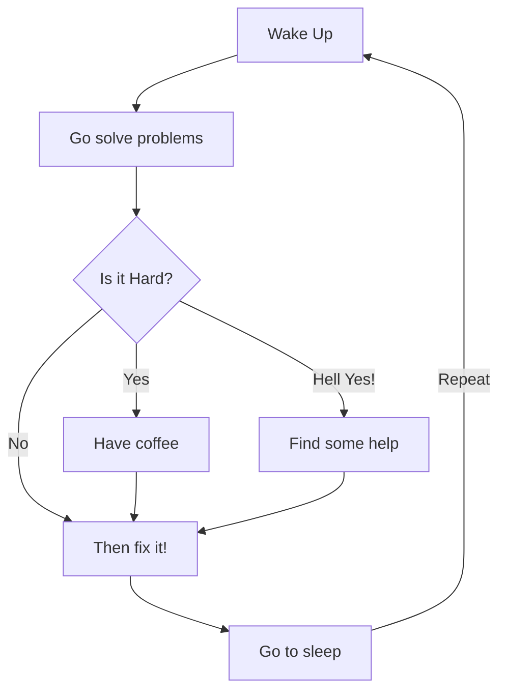

# Mathieu
I'm Mathieu from France, freelancer, expert in cloud and data. I love playing around with Azure and, frome time to time, with AWS. I'm also an advisor for several startups like [Sparkline](https://sparkline.xyz/equipe/) and [Nricher](https://www.linkedin.com/company/nricher/?originalSubdomain=fr). Last but not least, I am an early stage investor/business angel: my last investments are: 

- [Crealo](https://www.crealo.app/), a solution for copyrights and royalties
- I joined the [Super Capital VC](https://www.supercapital.vc/) fund
- I am a forme member of [Leonis Investissement](https://leonis.vc/) Clud.

If you're looking for a BA, I would be happy to read your deck. 

<!--
**mbesson/mbesson** is a ✨ _special_ ✨ repository because its `README.md` (this file) appears on your GitHub profile.
-->
What I do: 

- 🔭 I’m currently working on a new [Online Course][courses] ...
- 🌱 I’m currently learning amazing things ...
- 👯 I help people to be programmers and feelancers ...
- ⚡ Fun fact : I'am DJ, Diver, Skateboarder and Surfer
- 📫 How to reach me: Instagram or email

## My 100% online React Bootcamp

 <strong>
    3 months to be a really good React Programmer
  </strong>
  

    Be a Master in React by building amazing projects
  

  
 
  

### Connect with me:

&nbsp;&nbsp;

&nbsp;&nbsp;

&nbsp;&nbsp;

&nbsp;&nbsp;

### Languages and Tools:

#### Cloud
[][youtubeplaylist]
[][youtubeplaylist]
[][youtubeplaylist]
[][youtubeplaylist]

 
 

#### Coding
[][youtubeplaylist]
[][youtubeplaylist]
[][youtubeplaylist]
[][youtubeplaylist]
[][youtubeplaylist]
[][youtubeplaylist]

 
 

#### Personal projects & Blog
[][youtubeplaylist]
[][youtubeplaylist]

 
 

#### AI & ML
[][youtubeplaylist]

 
 

### My daily routine :

### :pencil2: Last Post

<!-- BLOG-POST-LIST:START -->
- [Coming soon](https://thetechpretender.substack.com/p/coming-soon)
- [My third article](https://mbesson.github.io/posts/azure_network_architecture/)
- [Secure your linux VM in the cloud](https://mbesson.github.io/posts/secure_linux/)
- [Hello World!](https://mbesson.github.io/posts/about/)
<!-- BLOG-POST-LIST:END -->

### 🔥 Recent GitHub Activity
<!--START_SECTION:activity-->
1. 🎉 Merged PR [#3](https://github.com/mbesson/mbesson/pull/3) in [mbesson/mbesson](https://github.com/mbesson/mbesson)
2. 💪 Opened PR [#3](https://github.com/mbesson/mbesson/pull/3) in [mbesson/mbesson](https://github.com/mbesson/mbesson)
<!--END_SECTION:activity-->

### ⭐ GitHub Stats

[courses]: https://formations.mikecodeur.com
[website]: https://go.mikecodeur.com/blog
[insta]: https://go.mikecodeur.com/instagram
[Youtube]: https://go.mikecodeur.com/youtube
[youtubeplaylist]: https://www.youtube.com/channel/UC7BNBNLwMF8GjgXLDP8PWQw